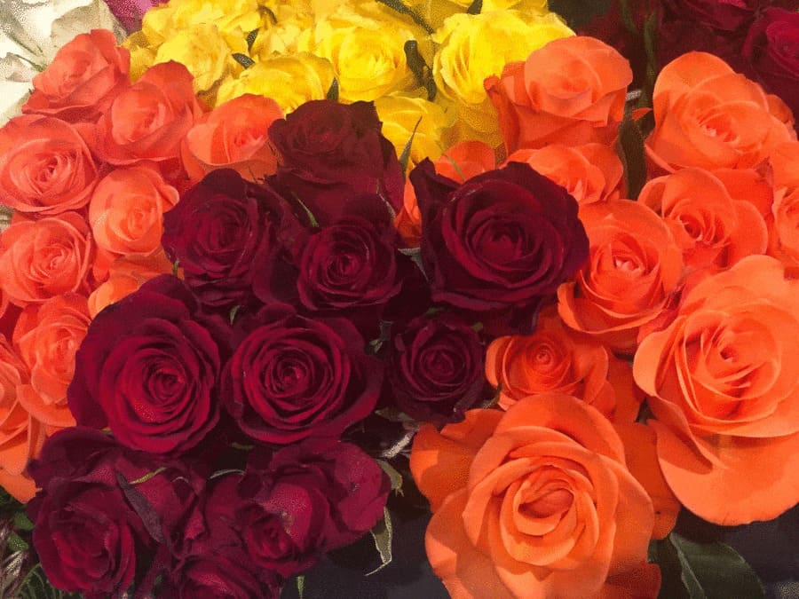

+++
title = "Floral Fantasy"
date = "2020-08-19"
draft = false
pinned = false
image = "unbenannt-3-1-1-1-.jpg"
+++
**Unsere erste Website**

Heute habe ich zusammen mit Larissa eine Website für ein Blumenladen gestaltet. Wir habe diese auf Carrd erstellt. Die ersten 30 min. haben wir Ideen gesammelt und haben die Blumen für die Website fotografiert. Als erstens sind wir in Casa, ein Laden für Interieurtrends, gegangen und dort haben wir die Plastikpflanzen, die eigentlich echt aussahen, fotografiert. Danach haben wir die Blumen im Coop fotografiert.

Nach die 30 min. ging los mit der Gestaltung der Website. Wir haben an diese für 45 min. gearbeitet. Ich habe die Bilder, die ich mit meinem Handy geschossen habe, auf dem PC geladen und zusammen mit Larissa die Website angefangen zu gestalten. Die Gestaltung lief problemlos, jedoch hatten wir Mühe mit der Publikation der Website.