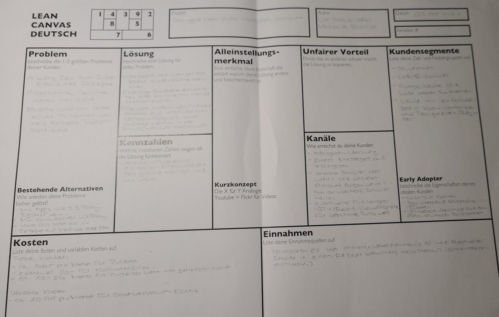

+++
title = "Home-Office"
date = "2021-02-03"
draft = false
pinned = false
image = "nelly-antoniadou-9x1p46y2kjo-unsplash.jpg"
+++
Heute dürften wir entscheiden, ob wir in der Schule arbeiten wollten oder von Zuhause aus. Ich und meine Teamkollegin Larissa haben uns entschieden unser Arbeit im Home-Office zu machen. 

Wir haben folgendes gemacht.

**Lean Canvas**

Als erstes haben ich und Larissa das Lean Canvas ausgefüllt. Lean Canvas ist ein Schema, der uns hilft ein Überblick von unserem Projekt zu behalten. Es ist in 9 Themenbereiche geteilt und somit sind auf das Schema 9 Feldern sichtbar. Jedes Feld vertieft sich in einem spezifische Thema wie zum Beispiel Problem oder Kosten. Leider könnten wir nicht alle 9 Feldern ausfüllen, weil wir momentan keine Antwort dafür haben. 

So sieht im Moment unserem Lean Canvas

**Kochen**

Da wir von Zuhause aus gearbeitet haben, haben wir uns entschieden selbstständig etwas zu Kochen. 

Ich habe mich entschieden ein schnelles und einfaches "Zvieri" zu vorbereiten. Nach eine kurze Recherche im Internet habe ich losgelegt mit Kochen und zwar habe ich Churros mit Schokolade Sauce zubereitet.

