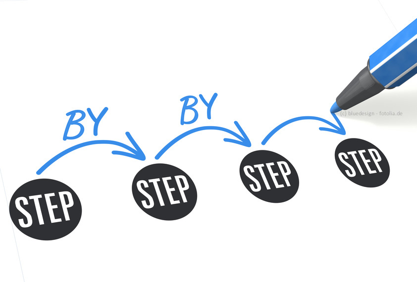
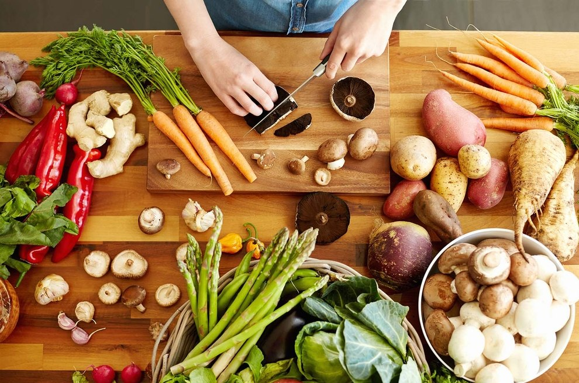

+++
title = "Next?"
date = "2020-09-09"
draft = false
pinned = false
image = "wie-gehts-jetzt-weiter.jpg"
+++
Heute ich und Larissa haben uns überlegt wie es weiter soll gehen mit unserem Projekt.

Wir haben uns entschieden eine Koch-Website zu erstellen mit unsere selbst probierte Rezepten.

Als erste Schritt wollen wir ein paar Rezepte ausprobieren und von denen die Prozedur aufschreiben und Bilder machen. Mit diesen Informationen wollen wir eine Website kreieren. Wir sind noch nicht sicher mit welchen Tool wir arbeiten wolle, aber wir haben ein paar von Website-Creator im Internet angeschaut. Im Moment die beste Varianten, die wir gefunden haben sind WIX, Jimdo und Weebly. Das Tool soll kostenlos sein. 

Auf unsere Website sollen mehrere Rezepten von verschiedenen Bereichen sein. Unsere anfangs Ideen sind Strugle Meals, Desserts und Internationale Küche. Wir wollen jedoch auch Challenges durchführen, wie zum Beispiel nur 5 Zutaten oder mit Madame Frigo zusammen. Madame Frigo sind verschiedenen Kühlschränke im Bern verteilt wo die Leute ungebrauchte Esswaren hineintun um sie nicht zu fortschiessen. 

Als nächstes werden wir unsere erste Rezept ausprobieren. Dies wird in den Herbstferien geschehen, da wir beide Zeit haben. 

Um die Bilder richtig zu bearbeiten wollen wir ein bisschen mehr von Photoshop lernen, sodass die Bilder eine bessere Qualität haben. Dies wird sicher unsere nächste Lernphase sein.