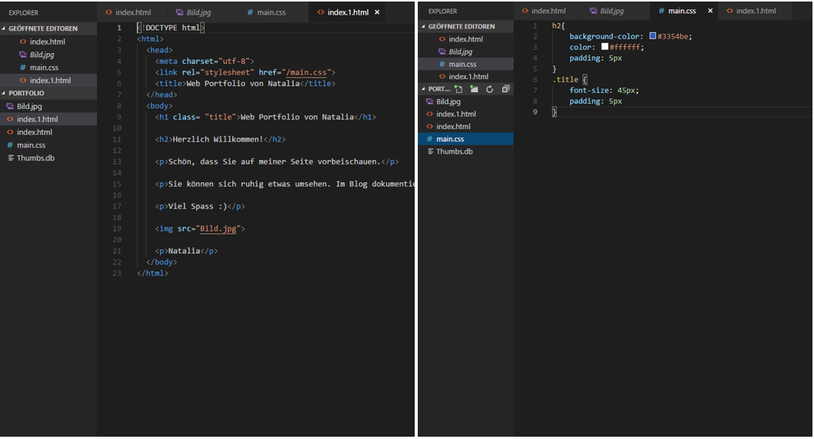
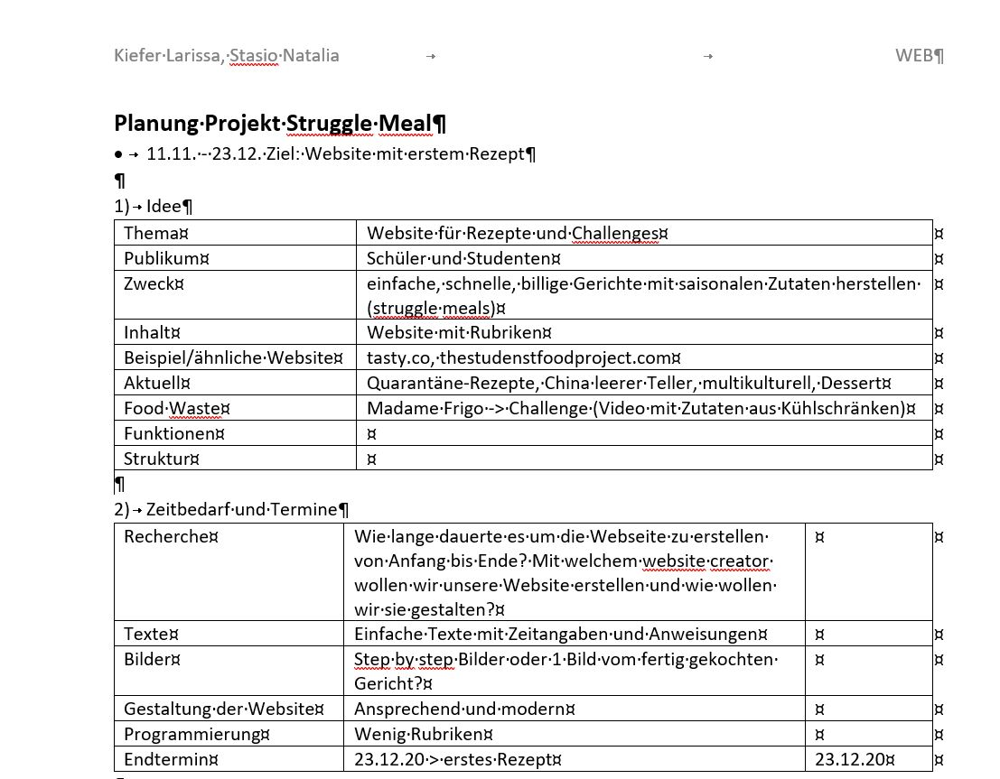

+++
title = "Reise in vier Etappen"
date = "2020-11-04"
draft = false
pinned = false
image = "unbenansnt.png"
+++
Den heutigen Tag war in zwei verschiedenen Teilen zusammengestellt.

### **code.makery**

In der erste und zweite Lektion bin ich mit Programmieren weitergefahren. Heute habe ich Teil 4 fertig gemacht und Teil 5 angefangen.  

### Meine Website - Eine Reise in vier Etappen

In der dritte und vierte Lektion haben ich und meine Teamkollegin Larissa an unser Projekt weiter gearbeitet. Wir haben eine erste Planung hergestellt und unsere Ideen zusammengetragen. 

1. Idee definieren und entscheiden

2. Planung erstellen

3 Ausführung der Aufgaben und Arbeiten

4. Website zusammenstellen und realisieren (programmieren)

