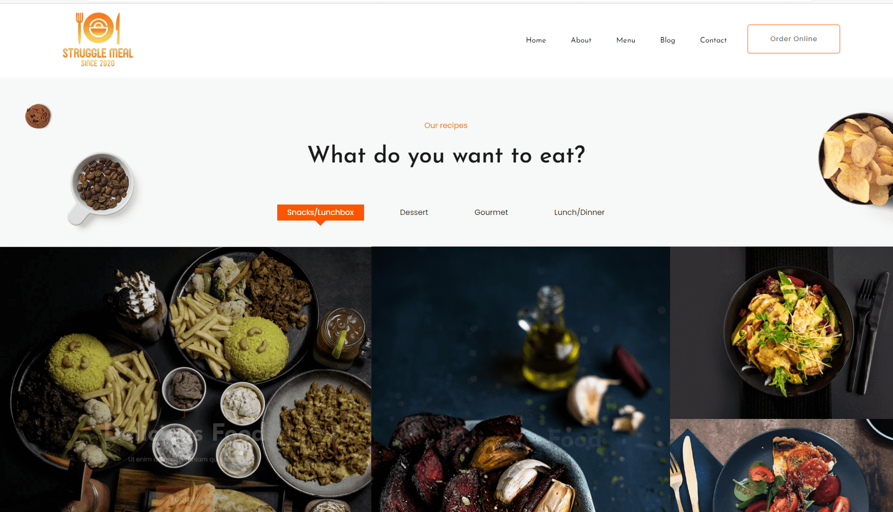
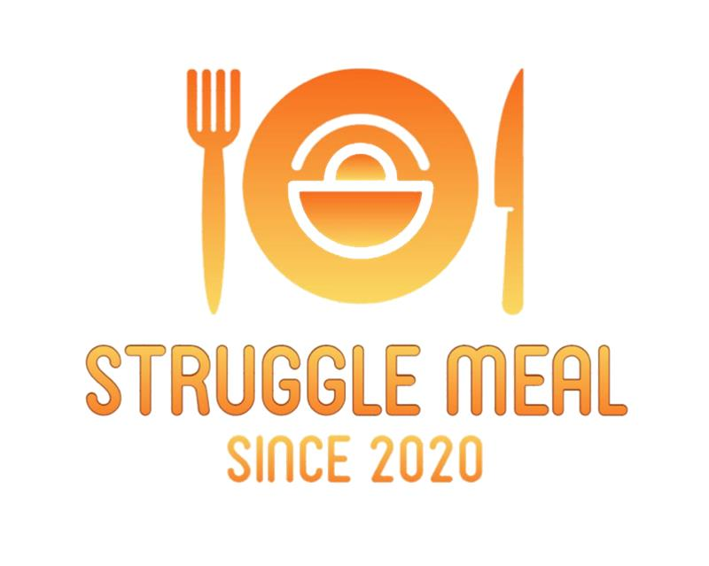

+++
title = "Struggle meal"
date = "2020-12-16"
draft = false
pinned = false
image = "logo.jpg"
description = "**Unser Website nimmt Form!!!**"
+++
**Unser Website nimmt Form!!!**

Heute ich und meine Teamkollegin Larissa haben angefangen mit der Gestaltung unsere Website.

Als erstes hat mir Larissa gezeigt was sie letzten Mal gemacht hat, da ich krank war. Nachher haben wir angefangen mit Programmieren. Da wir eine Vorlage haben müssen wir nicht von 0 anfangen und für uns ist es einfacher die Website zu gestalten.

So sieht im Moment unsere Website aus.

Wir haben auch unser eigene Logo kreiert. So sieht er aus.

