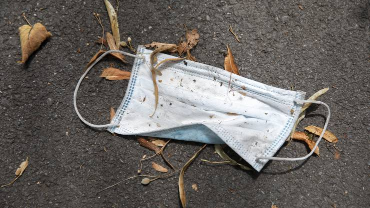

+++
title = "Umfrage in Bern zu unserer Idee"
date = "2020-08-26"
draft = false
pinned = false
image = "940.jpg"
+++
Ich und meine Arbeitspartnerin sind heute nach Bern gegangen um Leuten zu fragen was sie über unserer Idee finden. Wir haben ausschliesslich nur Mädchen in unser Alter befragt.

Wie schon im früheren Blogeintrag steht wollen ich und Larissa eine Beauty Website, die die Mädchen helfen soll mit selbstgemachten Masken, Tutorials und Rezensionen.

Vielen sagten, dass so etwas schon gibt, zum Beispiel man findet viele Tutorials auf Instagram und Youtube. Ein paar haben sogar gesagt, dass manche Beauty-Tipps auch auf TikTok sind. Jedoch wären sie froh wenn sie nicht lange suchen müssten und alles auf ein einzige Ort zu finden ist. 

Genau so könnte unsere Website gestaltet werden. Wir sammeln die viele Tipps auf dem Internet und publizieren nur die einzige, die wirklich etwas bringen. So müssen die Mädchen sich nicht sorgen machen ob es wirklich wirksam ist oder nicht.

Wir haben dazu auch der Umgebung beobachtet und haben festgestellt, dass am Boden viel Abfall liegt und vor allem sind immer Schutzmasken. Dies liegt daran, dass im Öffentliches Verkehr ein Maskenpflicht gilt. Nach dem aussteigen sollte es mehrere Abfalleimer speziell für die Schutzmasken geben, sodass diese nicht wegfliegen und am Boden landen.

