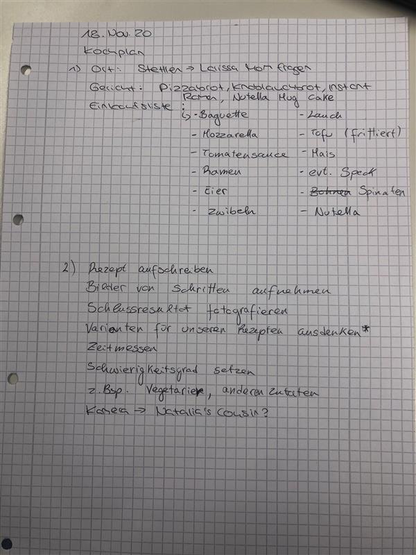
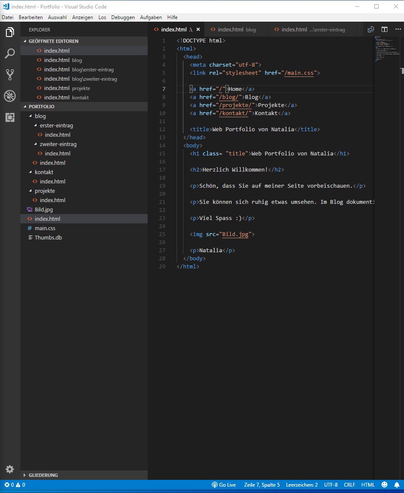

+++
title = "unser Projekt entwickelt sich"
date = "2020-11-11"
draft = false
pinned = false
image = "jesse-kao-259sknwkhly-unsplash-3-.jpg"
+++
**Projekt**

In den ersten zwei Lektionen ich und meine Teamkollegin Larissa haben uns auf unser Projekt fokussiert. Wir haben eine Teambesprechung durchgeführt und haben der nächste Schritt geplant. Nächsten Mittwoch, 18. November 2020, werden wir zusammen kochen. Wir haben uns entschieden, dass wir zuerst in Bern einkaufen und danach bei Larissas zuhause kochen.

**Programmieren**

In den weiteren Lektionen war ich allein, da Larissa früher weggehen musste. Ich habe mich weiter in das Code.Makery vertieft und habe Teil 5 und 6 erarbeitet. Diese Teile gingen problemlos.

