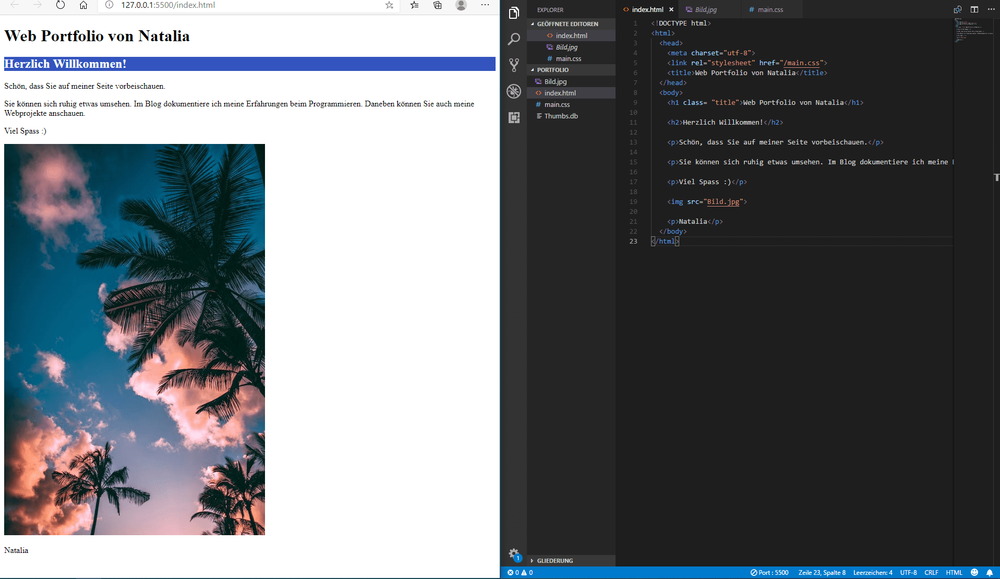

+++
title = "Weiter mit Programmieren (Code Makery Teil 2-3)"
date = "2020-10-28"
draft = false
pinned = false
image = "1028px-visual_studio_code_1.18_icon.svg.png"
+++
Heute haben wir im Web mit programmieren weiter gemacht. Am Anfang hatte ich Probleme mit meine Website, weil irgendwie alles gelöscht war. Zum Glück konnte mich Marco helfen und musste nicht alles von vorne anfangen.

Heute habe ich meine Website mit Netlify veröffentlicht. Danach habe ich probiert die Schriftgrösse und Farbe zu ändern. Der Farbenänderung ging problemlos, jedoch konnte ich die Schriftgrösse nicht ändern.

Diese Schritte sind nur mit die CSS-Regel möglich

Heute war die Stimmung sehr angespannt, da wir nicht wussten wie es weiter gehen wird mit die Corona-Massnahmen. Wird im Distanz-Unterricht weiter gehen oder Präsenz-Unterricht?